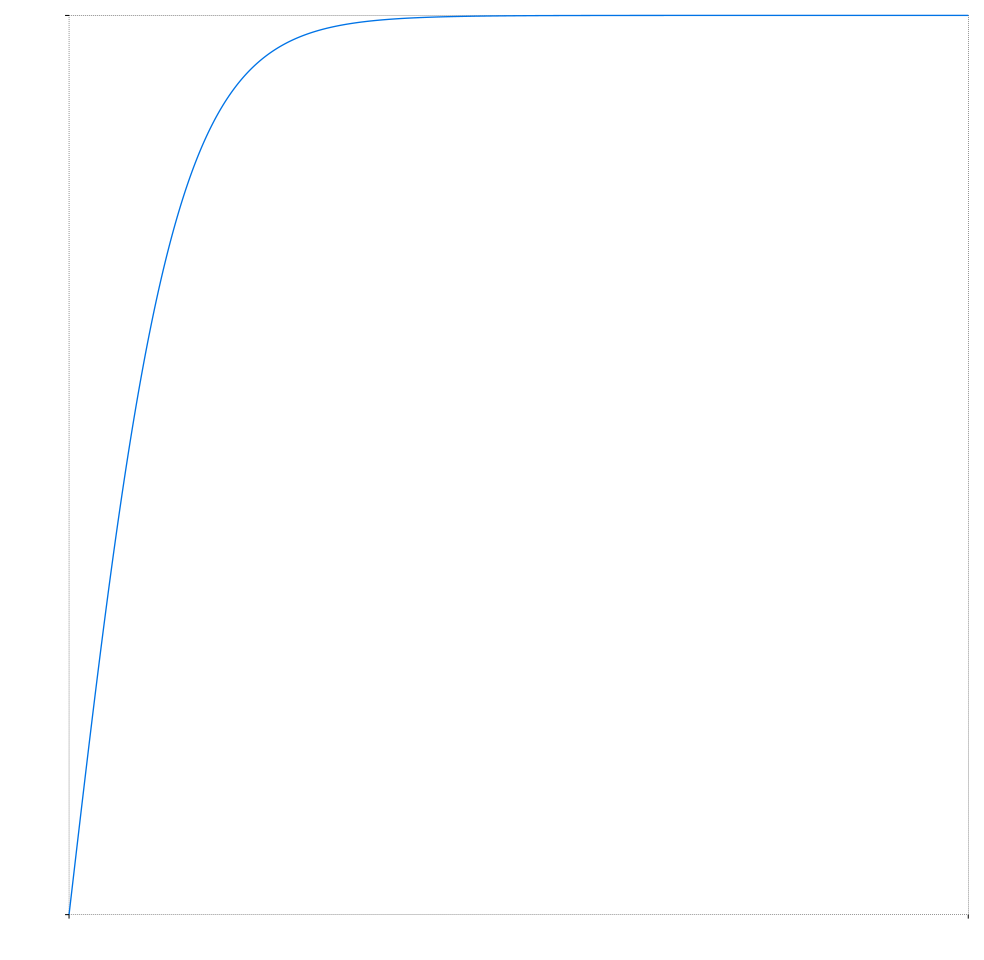
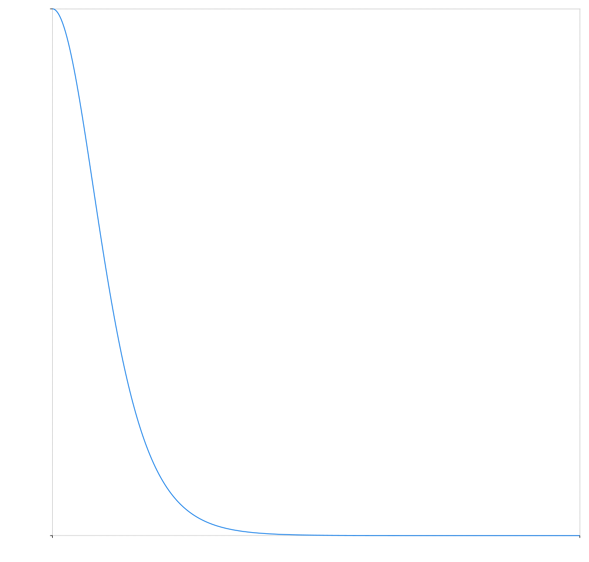
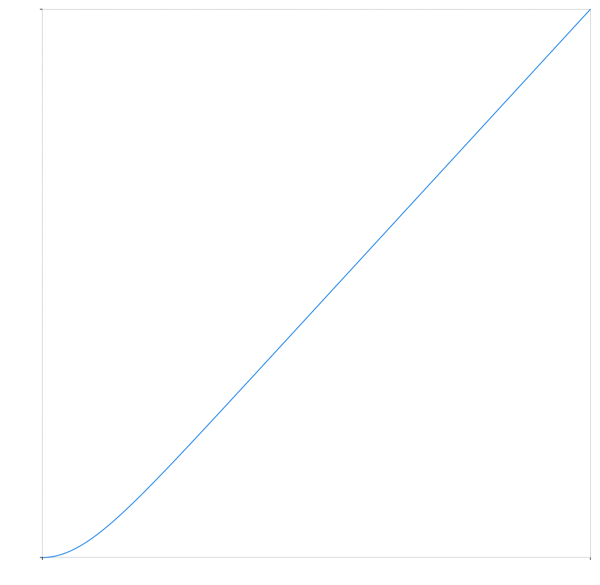

# ToyoGR_code_sim

## Requirements
g++ 12.2.0

## Configure
Find [src/Arguments/SimulationArguments.hpp](src/Arguments/SimulationArguments.hpp) and adjust parameters.

## Running
Windows cmd example
```
cd src
mkdir build\Debug
g++ -g3 -O0 -std=c++20 -c Main.cpp -o .\build\Debug\Main.o && g++ -g3 -O0 -std=c++20 .\build\Debug\Main.o -o .\build\Debug\outDebug.exe
.\build\Debug\outDebug.exe    
```

##  Output
Executable creates `.svg` plots for acceleration, velocity and ball position for both the static and newtonian gravitational model.

See `/output_samples` folder for sample plots.






## 3rd party libs
 - [Signalsmith lib for the 2d plots](https://signalsmith-audio.co.uk/code/plot/html/)
